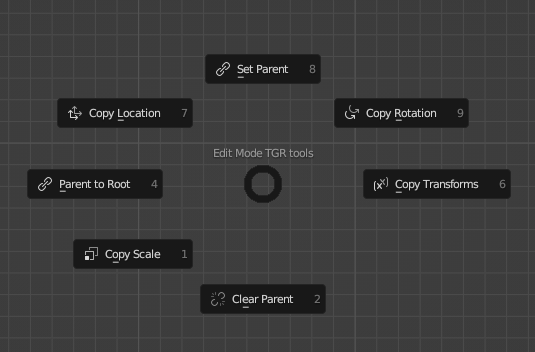
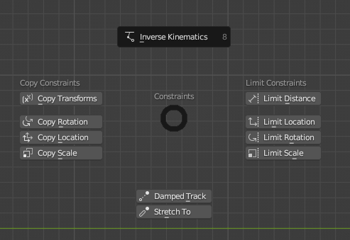

# Telergy Rigger

Our advanced toolset empowers riggers with an array of specialized features and shortcuts, significantly accelerating
the rigging workflow.

Harness the power of automated rigging processes, intuitive controls, and a comprehensive set of tools, all designed to
optimize efficiency and precision. Say goodbye to repetitive tasks and welcome a seamless rigging experience.

## For whom is it for?

It was designed for more experienced Blender riggers to automate tasks such as copying the
transforms of a chain of bones to another chain. It doesn't mean that less experienced riggers can't use the power of
our addon. It also comes with tools to help with the more basic parts of rigging such as parenting and creating simple
constraints.

## Manual

Here you'll find all the explanations of every functionality of this addon

1. ### How to install
   To install this addon you'll need to go to the Blender edit menu on the top toolbar, select Preferences, navigate to
   the
   Add-ons tab, click the install button on the top right and find your .zip file containing this addon. After
   installing
   it, you'll need to mark the check-box to enable it.
2. ### Creating a TGR rig
   If you didn't yet creat an Armature object, the easiest way to start with the **TelergyRigger** addon is to add an
   armature using the `SHIFT+A` command and choosing the **TGR Armature** option, it should be one of last in the add
   menu.
   This will create a bone called 'ROOT' and set it up as the armature root bone and orient it to the world so the axis
   of
   both world and bone are aligned. It will also set your armature viewport
   display to be shaded as wire, to be in front of the other objects, to show the bone names and the axis of each bone.

   If you already created an armature you will have to set up the configurations manually. The main one is to set the
   root
   bone, **TelergyRigger** requires that you have a root bone to function correctly in many operators, the other
   configurations are optional. To set up the root bone you'll need to be in edit mode and open the *Telergy Rigger* tab
   on
   the N-Panel, there you will find a field to choose your armature and when you do, it will open another field to
   choose a
   bone to be used as the root. After that you're all set to use all the functionalities of this addon.
3. ### Prefixes (DEF, TGT, MCH, CTRL)
   This addon depends heavily on bones prefixes, so it's really important to understand what they mean:
    * **DEF:** Bones with this prefix are the only bones that are capable of deforming the mesh, they're not meant to be
      controlled directly;
    * **TGT:** Bones with this prefix are bones that the DEF bones will copy the transforms from, they can also become
      CTRL bones if needed;
    * **MCH:** Bones with this prefix are mechanism bones, they're used to isolate, calculate, replace, intermediate and
      so on, they're also not meant to be controlled directly;
    * **CTRL:** Bones with this prefix are the only bones that should be able to be controlled by the end user.

   These prefixes can be changed in the addon's preferences.
4. ### Edit Mode
   While in edit mode, the operators shown in the *Telergy Rigger* tab and the operators that are available will be
   different from the ones shown in pose mode. In this section we'll take a look at all the operators and panels
   available in this mode.
    1. #### Adding a bone
       While using this addon, when you press `SHIFT-A` it won't create a bone directly, instead it will show an add
       menu with two options: *Deform Bone* and *Non-Deform Bone*. As the name says, the first one will create a bone
       with the option *deform* of the bone turned on, and it will also spawn the bone aligned with the world, another
       thing is that it will already be parented with the root bone. The second will do the same thing, but this time
       with the *deform* option turned off.
    2. #### Pie Menu
       

       In edit mode you'll have a new pie menu that will be spawned when pressing the letter `D` by default. This pie
       menu
       contains some operators to keep things organized in a simple and intuitive place. It comes with the following
       options:
        * **Set Parent:** It does the exact same thing as when you press `CTRL+P` in armature edit mode to parent bones;
        * **Clear Parent:** It does the exact same thing as when you press `ALT+P` in armature edit mode to un-parent
          bones;
        * **Parent to Root:** It parents the selected bones to the root bone that was set up for the armature,
          regardless if
          it's hidden;
        * **Copy Transforms:** It copies the transformation of the active bone to the selected bones;
        * **Copy Location:** It copies the location of the active bone to the selected bones, selected bones will
          maintain
          size
          and orientation and will be placed at the head of the active bone;
        * **Copy Rotation:** It copies the rotation of the active bone to the selected bones, selected bones will
          maintain
          size
          and location and will be oriented in the same way as the active bone;
        * **Copy Scale:** It copies the scale of the active bone to the selected bones, selected bones will maintain
          orientation and location and will be scaled to be the same size as the active bone.
    3. #### Create Sub-Panel
       In the *Telergy Rigger* panel you'll find a sub-panel called **Create**, inside this panel there are a few
       buttons to trigger some operators:
        * **Bones on Points:** Creates bones on every joint of the selected bones, the new bones are parented to the
          root bone. It's able to choose the size and if the bone is deform on the last action panel;
        * **Create TGT:** Makes a copy of all the DEF bones, rename them to be TGT and send them to the TGT layer. TGT
          bones are non-deform.
        * **Remove TGT:** Deletes all TGT bones.
    4. #### Parenting Sub-Panel
       The parenting sub-panel comes with two buttons:
        * **Parent to Root:** Parents the selected bone with the root bone;
        * **Connect Bones:** Connects the selected bones, but instead of making the tail of the parent bone go to the
          head of the child bone, the head of the child bone goes to the tail of the parent bone.
5. ### Pose Mode
   In this section you'll see the operators and panels that are exclusive to the pose mode.
    1. #### Custom Properties
       When first creating the DEF and TGT bones, this panel should be empty. It shows all the custom properties added
       to all the bones separated by bone names, so you can access these properties faster without having to select a
       particular bone and search for its custom properties.
    2. #### Pie Menu
       

       Ind pose mode you'll have a new pie menu that will be spawned when pressing the letter `D` by default. This pie
       menu contains some frequent used constraints to be accessed in a faster way. It comes with the following
       constraints:
        * **Inverse Kinematics**;
        * **Copy Transforms**;
        * **Copy Location**;
        * **Copy Rotation**;
        * **Copy Scale**;
        * **Limit Distance**;
        * **Limit Location**;
        * **Limit Rotation**;
        * **Limit Scale**;
        * **Damped Track**;
        * **Stretch To**.
    3. #### Constraints
       This one is a sub-panel containing operators that end up creating constraints in one or more bones, these
       properties are:
        * **Isolate Rotation:** Isolates the rotation of the selected bones from their parent. When the parent rotates,
          the bones which were isolated will keep their orientation but will follow the parent's tail location;
        * **Create Rotation Chain:** Creates a chain of copy rotation to the selected bones, it also creates a secondary
          bone that when rotated will not rotate the chain as well;
        * **Copy Transforms to Chain:** Add the *Copy Transforms* constraint to all the bones of the selected chain
          according to the prefixes set. Bones with the *From Prefix* will be the target of the bones with the
          *To Prefix*, apart from the prefixes, the name of the bones from both chains must be equal;
        * **Create IK Pole Target:** Creates and sets the pole target for a chain with the *IK* constraint. The
          parameter *First Bone* is the name of the first bones of the chain (e.g. Thigh, Upper Leg, Upper Arm), the
          *Last
          Bone* is the bone with the *IK* constraint on, *Placement Bone* is the bone from where you'd like your pole
          to be made. The *Pole Distance* parameter dictates the distance that the pole target will be from the
          *Placement
          Bone*'s head and *Pole Angle* is the same as we see in the *IK* constraint.
    4. #### TGT
       This sub-panel shows operators that are related to the **TGT** bones, at the moment only operators are available:
        * **Bind TGT:** Creates a copy transforms to all the DEF bones targeting their TGT pairs. E.g. DEF_PELVIS and
          TGT_PELVIS;
        * **Unbind TGT:** Removes all the copy transforms from the DEF bones targeting their TGT pairs.
6. ### Utilities
   The utilities panel is available in both edit and pose modes, it comes with some naming and selecting utilities.
    1. #### Naming
       This sub-panel contains some operators that will change the name of one or more bones, if no bones are selected
       the effect will be done on all the bones. The operators are:
        * **Add Prefix:** Adds a prefix to the bones names;
        * **Remove Prefix:** Removes a prefix from the bones names;
        * **Add Suffix:** Adds a suffix to the bones names;
        * **Remove Suffix:** Removes a suffix from the bones names;
        * **Clean Name Up:** Moves numbered suffixes to before the left and right suffixes if they exist and change the
          separators to the one default from the preferences.
    2. #### Selection
       This sub-panel has for now a single operator, the **Search and Select**. Just like the name says, it will search
       and select the bones that match the value given. E.g. Searching DEF will select all the bones with the DEF piece
       in their name.
7. ### Bone Layers
   In this panel you'll find by default three layers, **DEF**, **TGT** and **MCH** these are the layers that the addon
   use to organise the bones. Using the *Track New* button you'll be able to track a new layer and add some data to it,
   like name, description, index and UI name. UI name is the name that will be shown in the panel. Using the *Edit*
   button you'll be able to choose a layer and edit its properties. You can change the three default ones, but it's not
   advisable. The last one is the *Remove* button, with this one you'll be able to choose a layer to be removed.

   Each layer that is being tracked shows three icons on its side, the first one, a filled circle icon, allows you to
   send the selected bones to that layer, if clicked with the `SHIFT` key pressed, the bones will be added to that
   layer and also keep in the current ones. The second icon, a filled arrow, allows you to select all the bones from
   that layer, with the `SHIFT` key pressed, it will keep the current selections and add the new ones. The last one, a
   lock icon, allows you to block the selection of the bones from that layer.
8. ### Rig UI
   In this panel you'll be able to create your own rig ui and generate the script to be sent to with the blend file. To
   do so, first you'll need layers tracked in the *Bone Layers* panel, you can only add layers that are already tracked.
    1. #### Creating the Rig UI
       To start adding elements to the rig ui, you'll need to press the '+' button. In the menu popped-up you can
       choose the type of element that you want to add to the rig ui. If you choose 'LABEL' you'll only need to add a
       value/text and choose in which line you want it to be placed at. If you choose 'LAYER', you'll need to add a
       value, this will be the name that will show on your Layer toggle button, you'll also need to choose the layer
       name, this is the name that you gave to the tracked layer, and at last, the line that you'd like it to be placed
       at.
    2. #### Editing the elements
       When adding the elements you might have noticed that you can click on them, even the labels, and when you click
       on them two new options appear: *Remove Item* and *Modify Item*. If you select one or multiple elements and
       click the remove item button, the selected items will be deleted. If you select the modify item button, you'll
       be able to alter the elements type, value, line and layer that it represents.
    3. #### Clear
       This one is quite straight forward, if you click it you'll be prompted with a dialog asking you if you really
       want to clear all the elements, if you click okay, all the elements will be deleted.
    4. #### Generate UI
       Clicking it will generate a python file that if you run, it will add a panel with a rig UI just like what you've
       created. It will also add the **Custom Properties** panel, so you can access those parameters easily even without
       the *Telergy Rigger* addon.

## Python API

If you'd like to use the operators from this addon in your blender scripts, here's the place for you!

### Operators

```Python
# Adds a deform bone to the 3D cursor location
# Must be in Edit Mode
bpy.ops.tgr.add_deform_bone()
```

```Python
# Adds a non deform bone to the 3D cursor location
# Must be in Edit Mode
bpy.ops.tgr.add_non_deform_bone()
```

```Python
# Adds a prefix to the selected bones, default prefix is empty
# Must be in Edit or Pose mode
bpy.ops.tgr.add_prefix(prefix: str = "")
```

```Python
# Adds a suffix to the selected bones, default suffix is empty
# Must be in Edit or Pose mode
bpy.ops.tgr.add_suffix(suffix: str = "")
```

```Python
# Adds an armature and a bone aligned with the world as the root bone
# Must be in Object mode
bpy.ops.tgr.add_tgr_armature()
```

```Python
# Aligns the bone to the world
# Must be in Edit Mode
bpy.ops.tgr.align_bone_to_world()
```

```Python
# Add copy transform constraints to the pairs of TGT and DEF bones
# Must be in Pose Mode
bpy.ops.tgr.bind_tgt()
```

```Python
# Create bones on every joint of the selected bones
# Must be in Edit Mode
# You can choose the created bones scale and if they deform or not
bpy.ops.tgr.bones_on_points(bone_scale: float = 1.0, deform: bool = False)
```

```Python
# Cleans the selected bones names see section 6.1 for more
# Must be in Edit or Pose mode
bpy.ops.tgr.clean_name_up()
```

```Python
# Connect the head of the child bone to the tail of the parent bone
# Works on selected bones
# Must be in Edit Mdde
bpy.ops.tgr.connect_bones()
```

```Python
# Copy the transforms of the active bone to the selected ones
# Must be in Edit Mode
# Can choose to copy the location, rotation and scale
bpy.ops.tgr.copy_transforms(copy_location: bool = True, copy_rotation: bool = True, copy_scale: bool = True)
```

```Python
# Copy the transforms of a chain of bones to another chain of bones
# from_prefix describes the prefix of the target chain
# to_prefix describes the prefix of the selected chain
# constraint_name is the name that will be given to the copy transforms constraint
# Must be in Pose Mode
bpy.ops.tgr.copy_transforms_to_chain(from_prefix: str = "", to_prefix: str = "", constraint_name: str = "")
```

```Python
# Creates the pole target to the specified IK chain
# For more see section 5.3
# Must be in Pose Mode
bpy.ops.tgr.create_ik_pole_target(
    first_bone_name: str = "",
last_bone_name: str = "",
placement_bone_name: str = "",
pole_distance: list[float, float, float] = [0.0, -0.5, 0.0],
pole_angle: float = 0
)
```

```Python
# Creates a rotation chain with the selected bones
# For more see section 5.3
# Must be in Pose Mode
bpy.ops.tgr.create_rotation_chain()
```

```Python
# Creates a duplicate of the DEF bones and rename them to TGT
# Also send them to the TGT layer
# If no bones are selected, create TGT from all bones except the root
# Must be in Edit Mode
bpy.ops.tgr.create_tgt()
```

```Python
# Isolate the selected bones rotation from their parent
# Must be in Pose Mode
bpy.ops.tgr.isolate_bone_rotation()
```

```Python
# Parent selected bones to the root bone
# Must be in Edit Mode
bpy.ops.tgr.parent_to_root()
```

```Python
# Removes the specified prefix from the bones names
# Must be in Edit or Pose Mode
bpy.ops.tgr.remove_prefix(prefix: str = "")
```

```Python
# Removes the specified suffix from the bones names
# Must be in Edit or Pose Mode
bpy.ops.tgr.remove_suffix(suffix: str = "")
```

```Python
# Deletes all bones that starts with the TGT prefix
# Must be in Edit Mode
bpy.ops.tgr.remove_tgt()
```

```Python
# Select all the bones that has the bone_name value in their names
# Must be in Edit or Pose Mode
bpy.ops.tgr.select_bones_by_name(bone_name: str = "")
```

```Python
# Select all the bones that are in the specified layer
# min value is 0 and max is 31
# Must be in Edit or Pose Mode
bpy.ops.tgr.select_layer_bones(layer: int = 0)
```

```Python
# Set the layer of the selected bones
# min value is 0 and max is 31
# Must be in Edit or Pose Mode
bpy.ops.tgr.assign_bones_to_collection(layer: int = 0)
```

```Python
# Deletes all the copy transforms constraints from the DEF bones targeting the TGT bones
# Must be in Pose Mode
bpy.ops.tgr.unbind_tgt()
```
